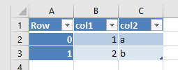
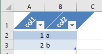

# pandas-xlsx-tables

Even though you might not like it, Excel isn't going anywhere. And Excel with tables is a lot beter than without: Reference columns by name, warnings when datatypes betwee rows change, no more freeze panes, custom filters or issues when you sort one column but not the other.

Out of the box Pandas does not support reading and writing excel tables, and as the API of pandas is already pretty complex. So instead of adding a feature inside Pandas this separte package provides the required utility functions to read and write between Excel Tables and Pandas DataFrames.



```python
>>> from pandas_xlsx_tables import xlsx_table_to_df
>>> df = xlsx_table_to_df("my_file.xlsx", "Table1")
>>> df
     col1 col2
Row
0       1    a
1       2    b
```
And the reverse process:

```python
>>> from pandas_xlsx_tables import df_to_xlsx_table
>>> df_to_xlsx_table(df, "my_table", header_orientation="diagonal", index=False)
```


